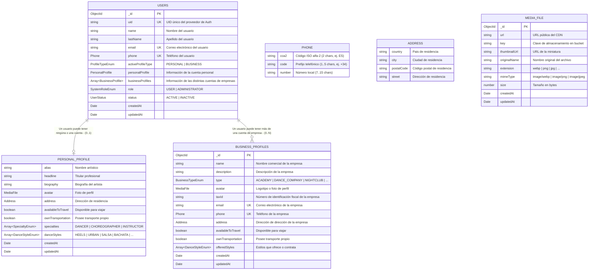

# 🗄️ Diagrama Entidad-Relación — Módulo de Usuarios (Subesquemas Embebidos)

## 1. Users

```mermaid
erDiagram
    USERS ||--o| PERSONAL_PROFILE : "Un usuario puede tener ningúna o una cuenta - (0..1)"
    USERS ||--o{ BUSINESS_PROFILES : "Un usuario puede tener más de una cuenta de empresa - (0..N)"

%%     USERS ||--o| PHONE : "Número de teléfono del propietario de la cuenta - (0..1)"
%%     BUSINESS_PROFILES ||--|| PHONE : "Número de teléfono de la empresa - (1..1)"

%%     PERSONAL_PROFILE ||--o| MEDIA_FILE : "Avatar opcional del usuario - (0..1)"
%%     BUSINESS_PROFILES ||--o| MEDIA_FILE : "Avatar o logotipo de la empresa - (0..1)"

%%     PERSONAL_PROFILE ||--|| ADDRESS : "Datos de dirección del usuario - (1..1)"
%%     BUSINESS_PROFILES ||--|| ADDRESS : "Datos de dirección del usuario - (1..1)"

    USERS {
        ObjectId _id PK
        string uid UK "UID único del proveedor de Auth"
        string name "Nombre del usuario"
        string lastName "Apellido del usuario"

        string email UK "Correo electrónico del usuario"
        Phone phone UK "Teléfono del usuario"

        ProfileTypeEnum activeProfileType "PERSONAL | BUSINESS"

        PersonalProfile personalProfile "Información de la cuenta personal"
        Array~BusinessProfile~ businessProfiles "Información de las distintas cuentas de empresas"

        SystemRoleEnum role "USER | ADMINISTRATOR"
        UserStatus status "ACTIVE | INACTIVE"

        Date createdAt
        Date updatedAt
    }

    PERSONAL_PROFILE {
        string alias "Nombre artístico"
        string headline "Titular profesional"
        string biography "Biografía del artista"
        MediaFile avatar "Foto de perfil"

        Address address "Dirección de residencia"

        boolean availableToTravel "Disponible para viajar"
        boolean ownTransportation "Posee transporte propio"

        Array~SpecialtyEnum~ specialties "DANCER | CHOREOGRAPHER | INSTRUCTOR"
        Array~DanceStyleEnum~ danceStyles "HEELS | URBAN | SALSA | BACHATA | ..."

        Date createdAt
        Date updatedAt
    }

    BUSINESS_PROFILES {
        ObjectId _id PK

        string name "Nombre comercial de la empresa"
        string description "Descripción de la empresa"
        BusinessTypeEnum type "ACADEMY | DANCE_COMPANY | NIGHTCLUB | ..."
        MediaFile avatar "Logotipo o foto de perfil"
        string taxId "Número de identificación fiscal de la empresa"

        string email UK "Correo electrónico de la empresa"
        Phone phone UK "Teléfono de la empresa"

        Address address "Dirección de dirección de la empresa"

        boolean availableToTravel "Disponible para viajar"
        boolean ownTransportation "Posee transporte propio"

        Array~DanceStyleEnum~ offeredStyles "Estilos que ofrece o contrata"

        Date createdAt
        Date updatedAt
    }

    PHONE {
        string cca2 "Código ISO alfa-2 (2 chars, ej. ES)"
        string code "Prefijo telefónico (1..5 chars, ej. +34)"
        string number "Número local (7..15 chars)"
    }

    ADDRESS {
        string country "Pais de residencia"
        string city "Ciudad de residencia"
        string postalCode "Código postal de residencia"
        string street "Dirección de residencia"
    }

    MEDIA_FILE {
        ObjectId _id PK
        string url "URL pública del CDN"
        string key "Clave de almacenamiento en bucket"
        string thumbnailUrl "URL de la miniatura"
        string originalName "Nombre original del archivo"
        string extension "webp | png | jpg | ..."
        string mimeType "image/webp | image/png | image/jpeg"
        number size "Tamaño en bytes"

        Date createdAt
        Date updatedAt
    }
```
